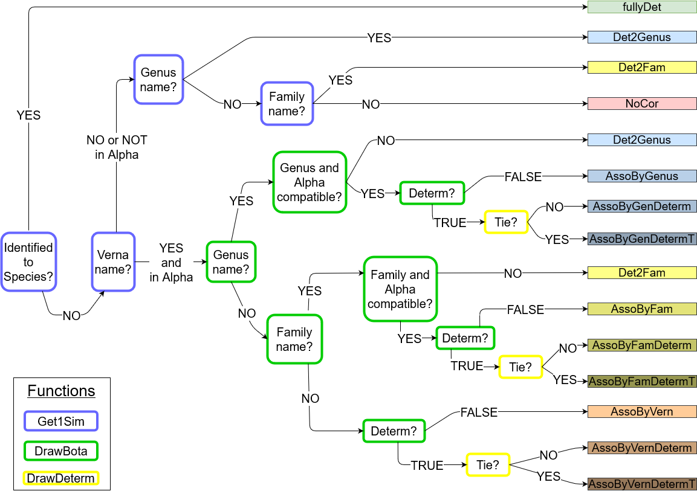

```{r, include = FALSE}
knitr::opts_chunk$set(
  collapse = TRUE,
  comment = "#>"
)
```

This document describes the methods and use of the package *vernabota* to gapfill missing botanical names using vernacular names, in the case of Guyafor census data.
The objective is to obtain a chosen number of simulated communities for which individuals only identified with a vernacular name are given a botanical name based on probabilities of association of vernacular and botanical names.
It is largely based on the work and codes from @Aubry-Kientz2013 and @Mirabel2018a.

# Method of association of a vernacular name with a botanical name

Be a tree *t* with a vernacular name *v*. 
This tree can have a known genus, only a known family or no botanical information at all.
The associated botanical names follow a categorical distribution *$\mathcal{Cat} (\alpha^v)$* 
where $\alpha^v = [\alpha^v_1, \alpha^v_2,..., \alpha^v_N]$  is the vector of probability of association of between the vernacular name *v* and each botanical name (so $\sum_{s=1}^N \alpha^v_i =1)$)
and N is the number of botanical name present in the inventories taken as a reference and/or the prior knowledge.

To get the vector $\alpha^v$, we use a Dirichlet-categorical scheme to combine a prior information based on expert knowledge that we updated with observed frequencies of association between the vernacular name *v* and each botanical name in the reference inventories $f^v = [f^v_1, f^v_2,..., f^v_N]$.

We considered $\lambda^v$ as hyperparameters of $\alpha^v$, *i.e.* the parameters of the prior distribution of $\alpha^v$.
The prior probability of association of the vernacular *v* with each botanical name *s* in [1,N] is $\lambda^v_s$ and is obtained as follows:

  * $\lambda^v_s = \frac{1}{m_v}$ if the botanical name *s* is associated to the vernacular name *v* AND belongs to the same genus than *t* (if there is a know genus) and the same family than *t* (if there is a known family). 
  $m_v$ is the number of botanical names meeting these conditions.
  * $\lambda^v_s = \frac{\epsilon}{N-m_v}$ otherwise ($\epsilon$ being a background noise)

The prior distribution of $\alpha^v \sim \mathcal{Dir}(N, \lambda^v)$.

As the Dirichlet distribution is the conjugated prior of the categorical distribution, the posterior distribution of the probabilities of associations $\alpha^v$ can be obtained by updating the expert knowledge with the observed frequency of association $f^v$.

So the posterior distribution of probability of association is $\alpha^v | f^v,\lambda^v  \sim \mathcal{Dir} (N, w_p \times \lambda^v_1 + (1-w_p) \times f^v_1,...,w_p \times \lambda^v_N+(1-w_p) \times f^v_N)$
where $w_p$ is the weigth given to the prior information. 

NB: $\lambda^v$ and $f^v$ are taken as frequencies to give the same weight to give the same weight to the prior and the observations when given an equal weight (*i.e.* when $w_p=0.5$). 


**In practice**, as we don't want to calculate the vector $\alpha^v$ for each tree, we create a matrix $\alpha$ of $\alpha^v$ that will be used for all trees.
We therefore don't have any information on the family or the genus at this stage.
We take $\lambda^v_s = 0$ for the botanical names that are not associated to the vernacular name *v* according to expert knowledge.
The matrix $\alpha$ have a lot of 0 (in case when there is no association according to expert knowledge, nor according to the data).
When we then consider the tree *t*, we replace non-null values by 0 when botanical names don't belong to the same genus than *t* (if there is a know genus) and the same family than *t* (if there is a known family).
We then replace 0 by $\epsilon$ divided by the number of value=0.

# Possible types of gapfilling

```{r flowchart, fig.cap="Flowchart of the possible correction", out.width = "100%" , echo=FALSE}

```

# Installing and loading the package

Before the first use, the package needs to be installed from GitHub:

```{r install, eval=FALSE}
devtools::install_github("EcoFoG/vernabota", build_vignettes = TRUE)
```

It can then be loaded.

```{r setup}
library(vernabota)
```

```{r setseed, echo=FALSE}
set.seed(56)
```


# Preparing the data

## Data that we want to gapfill

This algorithm works on a dataset formatted as it is when obtained using the function *EcoFoG::Guyafor2df* or from the online data plateform of Paracou.

Here, we take the example of data from plot 6, census of 2016, and use subplot 1 as the dataset that we want to gapfill. 
We call this dataset *Data2fill*.

In this dataset, the column VernName should not contain any special character such as é, è or œ (data from the Guyafor database should not have these special characters).

We use the function *PrepData* to prepare the data.

```{r get data to fill}
data(Paracou6_2016)
Data2fill <- Paracou6_2016[Paracou6_2016$SubPlot==1,]
Data2fill <- PrepData(Data2fill)
str(Data2fill)
```

## Prior: expert knowledge on possible associations

The prior is a data.frame with vernacular names in columns and botanical names in rows (given in 3 column Family, Genus and Species. 
For a given vernacular name and a given botanical name, the value is 1 if the association is possible, according to expert knowledge, and 0 if not.

We propose three prior files resulting from the work of Jean-Maurice MadKau @Madkaud2012, updated using the code *5_Dev/Prior_Verna_Bota_Name_Cleaning/Prior_Verna_Bota_Name_Cleaning.Rmd* in January 2022.


```{r load priors, echo=TRUE}
data(PriorAllFG_20220126)
PriorAllFG <- PriorAllFG_20220126
str(PriorAllFG[,1:10])

data(PriorParacouNew_20220126)
PriorParacouNew <- PriorParacouNew_20220126
# str(PriorParacouNew[,1:10])

# data(PriorParacouOld_20220126)
# PriorParacouOld <- PriorParacouOld_20220126
# str(PriorParacouOld[,1:10])
```

We use the function *PrepPrior* to prepare the prior.
Here we use the default settings because we want to remove the botanical names with non-determined species,
and the botanical names not in Guyafor from the prior.
The reason is that these names would always lead to incorrect association when using the *CompareSim* function (see below).
However, one may decide to keep them, this would lead to

* possible associations with a botanical name of the form *Genus-Indet.* with a BotaCodeCor="AssoByGenus" or "AssoByFam" (with RemoveIndetSp==TRUE) .

* possible associations with a botanical name that has never been observed in Guyafor (with RemoveNotGuyafor==TRUE).

In these latter cases, only the prior information would be used.

```{r preparePrior, echo=TRUE}
PriorAllFG <- PrepPrior(PriorAllFG)
str(PriorAllFG[,1:10])

PriorParacouNew <- PrepPrior(PriorParacouNew)
# str(PriorParacouNew[,1:10])
# 
# PriorParacouOld <- PrepPrior(PriorParacouOld)
# str(PriorParacouOld[,1:10])
```

## Observation data to update the prior

To built the matrix of association between vernacular and scientific names, we can either use the same dataset than the one for which we want to perform the association or another dataset.
The user needs to carefully think this choice through.
Using the same dataset can lead to underestimating diversity as it consider that there cannot be any dispersal of species from outside.
Using a too wide data set could lead to associating species that are not present in the area.

In this dataset, the column VernName should not contain any special character such as é, è or œ (data from the Guyafor database should not have these special characters).

Here, we use data from plot 6 (all four subplots), census of 2016.
We call this dataset *DataAsso*.

We use the function *PrepData* to prepare the data.

```{r get data for asso}
DataAsso <- Paracou6_2016
DataAsso <- PrepData(DataAsso)
str(DataAsso)
```


# Running some simmulations using the function SimFullCom

*NB*: for these examples, a low number of simulations is used.
For real tests, a higher number of simulations should be performed.

## Example 1: using the same dataset for Data2fill and DataAsso, without prior

```{r runSimFullCom1, echo=TRUE}
DataNSim <- SimFullCom(Data2fill, NSim=2, eps=0.01)
str(DataNSim, max.level = 1)
colnames(DataNSim[[1]])
table(DataNSim[[1]]$BotaCorCode)
```

## Example 2: using different dataset for Data2fill and DataAsso, with a prior (different weighing of the prior and the observations)

Here we have a weigth of 0.2 for the prior and of 0.8 for the observations.

```{r runSimFullCom2, echo=TRUE}
DataNSim <- SimFullCom(Data2fill=Data2fill, DataAsso=DataAsso, 
                       prior=PriorAllFG, wp=0.2, NSim=2, eps=0.01)
#str(DataNSim, max.level = 1)
#colnames(DataNSim[[1]])
table(DataNSim[[1]]$BotaCorCode)
```

## Example 3: getting the more likely associations (using Determ=TRUE)

As we want to simulate the more likely associations, we set NSim to 1.

```{r runSimFullCom3, echo=TRUE}
DataNSim <- SimFullCom(Data2fill=Data2fill, DataAsso=DataAsso, 
                       prior=PriorAllFG, wp=0.2, NSim=1, eps=0.01, Determ=TRUE)
#str(DataNSim, max.level = 1)
#colnames(DataNSim[[1]])
table(DataNSim[[1]]$BotaCorCode)
```


# Comparing different settings for the simulations using the function CompareSim

*NB*: for these examples, a low number of simulations is used.
For real tests, a higher number of simulations should be performed.

## Comparing different settings

The choice of the settings used for the gapfilling is important for the quality of the estimation. 
It is specific to the study and the dataset of the user, so it is interesting to compare different
settings and to choose the one that performs the best:

* choice of observation data (DataAsso): Using the same dataset (or a dataset to limited in its size
or spatial extent) can lead to underestimating diversity as it underestimate the  
dispersal of species from outside.
Using a too wide data set could lead to associating species that are not present in the area.

* the choice of the prior data depends on the team that has performed the vernacular identification
and on the spatial extent of the data to gapfill and of the prior.

* the relative weights given to the prior and the observation depends on the quantity and
quality of information brought by the prior and the observation.

* the effect of the value of $\epsilon$ can also be tested.

* the overall percentatge of trees used for testing (*pc2fill*) can also be tested.

* the percentage of trees that we consider determined to the family (*pcFamilyDet*)
or to the genus (*pcGenusDet*) should logically be chosen to be similar to these 
in the data set we want to gapfill (but this can also be changed).

For this, we use the function *CompareSim*.
This function "masks" the identification of the trees fully identified and test
if it can be successfully retreived with the setting chosen.
The proportion of correct association is called accuracy.

We first create lists for the data to gapfill, the priors and the observation data  
that we want to test:

```{r listCompare}
D2fill <- list(Data2fill)                   # data to gapfill
priors <- list(PriorAllFG, PriorParacouNew) # priors
DAsso <- list(NULL, DataAsso)               # observation data
```

Then we create the Param data.frame to explicit the different scenarios to test:

```{r ParamCompare}
Param <- data.frame(priors = c(1,1,2,1,1),  # here, we used the first prior 
                    # of the list for scenario 1, 2, 4 and 5 and the seccond for scenario 3
                    dataFill = c(1,1,1,1,1),
                    dataAsso = c(2,1,2,2,2), # for the second scenario dataAsso is NULL (the data to gapfill are used)
                    weights = c(0.5,0.5,0.5,0.2,0.8),
                    NbSim = c(10,10,10,10,10),
                    pc2fill = c(10,10,10,10,10),
                    pcFamilyDet = c(25,25,25,25,25),
                    pcGenusDet = c(25,25,25,25,25),
                    eps = c(0.01,0.01,0.01,0.01,0.01),
                    Determ = c(FALSE,FALSE,FALSE,FALSE,FALSE),
                    Results_Simulations = c(FALSE,FALSE,FALSE,FALSE,FALSE))
Param
```

We can then run *CompareSim*, visualise the scenarios using *summary* and plot their accuracy using *plot*.

```{r Compare, out.width = "80%"} 
VBS_test <- CompareSim(Param = Param ,
                       priors = priors, D2fill = D2fill, DAsso = DAsso)
summary(VBS_test)
plot(VBS_test)
```

## Testing deterministic associations

```{r ParamComparedeter}
Param <- data.frame(priors = c(1,1,2,1,1),  
                    dataFill = c(1,1,1,1,1),
                    dataAsso = c(2,1,2,2,2), 
                    weights = c(0.5,0.5,0.5,0.2,0.8),
                    NbSim = c(10,10,10,10,10),
                    pc2fill = c(10,10,10,10,10),
                    pcFamilyDet = c(25,25,25,25,25),
                    pcGenusDet = c(25,25,25,25,25),
                    eps = c(0.01,0.01,0.01,0.01,0.01),
                    Determ = c(TRUE,TRUE,TRUE,TRUE,TRUE),
                    Results_Simulations = c(FALSE,FALSE,FALSE,FALSE,FALSE))
Param
```

Here there will be lots of warning messages in case when two association are equality likely.

> TO DO: see how to print only the first few warnings.

```{r Comparedeter, out.width = "80%"} 
VBS_test <- CompareSim(Param = Param ,
                       priors = priors, D2fill = D2fill, DAsso = DAsso)
summary(VBS_test)
plot(VBS_test)
```


## Checking stability of association accuracy

```{r ParamCompares_stab}
Param <- data.frame(priors = c(2,2,2),  
                    dataFill = c(1,1,1),
                    dataAsso = c(2,2,2),
                    weights = c(0.5,0.5,0.5),
                    NbSim = c(10,10,10),
                    pc2fill = c(10,10,10),
                    pcFamilyDet = c(25,25,25),
                    pcGenusDet = c(25,25,25),
                    eps = c(0.01,0.01,0.01),
                    Determ = c(FALSE,FALSE,FALSE),
                    Results_Simulations = c(FALSE,FALSE,FALSE))
Param
```

```{r Compare_stab, out.width = "80%"} 
VBS_test <- CompareSim(Param = Param ,
                       priors = priors, D2fill = D2fill, DAsso = DAsso)
summary(VBS_test)
plot(VBS_test)
```

Here we seen that we could increase the number of simulations.

<!--

## Examining wrong associations

```{r ParamCompares_results}
Param <- data.frame(priors = c(2), 
                    dataFill = c(1),
                    dataAsso = c(2), 
                    weights = c(0.5),
                    NbSim = c(10),
                    pc2fill = c(10),
                    pcFamilyDet = c(25),
                    pcGenusDet = c(25),
                    eps = c(0.01),
                    Determ = c(FALSE),
                    Results_Simulations = c(TRUE))
Param
```

We now want to examine the association tree by tree.
We retreive one of the simulation of the only scenario, as data.table.

```{r Compare_results} 
VBS_test <- CompareSim(Param = Param ,
                       priors = priors, D2fill = D2fill, DAsso = DAsso)
Res2 <- VBS_test@results[[1]][[2]] # here we retreive the second simulation of scenario 1.
str(Res2)
```

-->

# Bibliography
