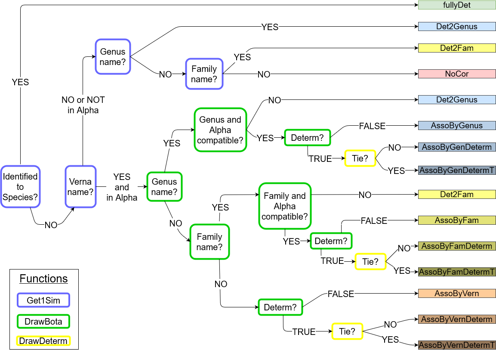

```{r, include = FALSE}
knitr::opts_chunk$set(
  collapse = TRUE,
  comment = "#>"
)
```

# Method of association of a vernacular name with a botanical name

Be a tree *t* with a vernacular name *v*. 
This tree can have a known genus, only a known family or no botanical information at all.
The associated botanical names follow a categorical distribution 
*$\mathcal{Cat} (\alpha^v)$* 
where $\alpha^v = [\alpha^v_1, \alpha^v_2,..., \alpha^v_N]$ is the vector of probability of association of between the vernacular name *v* and each botanical name 
(so $\sum_{s=1}^N \alpha^v_i =1)$)
and N is the number of botanical name present in the inventories taken as a reference and/or the prior knowledge.

To get the vector $\alpha^v$, we use a Dirichlet-categorical scheme to combine a prior information based on expert knowledge that we updated with observed frequencies of association between the vernacular name *v* and each botanical name in the reference inventories $f^v = [f^v_1, f^v_2,..., f^v_N]$ [@Aubry-Kientz2013].

We consider $\lambda^v$ as hyperparameters of $\alpha^v$, *i.e.* the parameters of the prior distribution of $\alpha^v$.
The prior probability of association of the vernacular *v* with each botanical name *s* in [1,N] is $\lambda^v_s$ and is obtained as follows:

* $\lambda^v_s = \frac{1}{m_v}$ if the botanical name *s* is associated to the vernacular name *v* AND belongs to the same genus than *t* (if there is a know genus) and the same family than *t* (if there is a known family). 
$m_v$ is the number of botanical names meeting these conditions.
* $\lambda^v_s = \frac{\epsilon}{N-m_v}$ otherwise ($\epsilon$ being a background noise)

The prior distribution of $\alpha^v \sim \mathcal{Dir}(N, \lambda^v)$.

As the Dirichlet distribution is the conjugated prior of the categorical distribution, the posterior distribution of the probabilities of associations $\alpha^v$ can be obtained by updating the expert knowledge with the observed frequency of association $f^v$.

So the posterior distribution of probability of association is 
$\alpha^v | f^v,\lambda^v  \sim \mathcal{Dir} (N, w_p \times \lambda^v_1 + (1-w_p) \times f^v_1,...,w_p \times \lambda^v_N+(1-w_p) \times f^v_N)$
where $w_p$ is the weight given to the prior information. 

NB: $\lambda^v$ and $f^v$ are taken as frequencies to give the same weight to give the same weight to the prior and the observations when given an equal weight (*i.e.* when $w_p=0.5$). 


**In practice**, as we don't want to calculate the vector $\alpha^v$ for each tree, we create a matrix $\alpha$ of $\alpha^v$ that will be used for all trees.
We therefore don't have any information on the family or the genus at this stage.
We take $\lambda^v_s = 0$ for the botanical names that are not associated to the vernacular name *v* according to expert knowledge.
The matrix $\alpha$ have a lot of 0 (in case when there is no association according to expert knowledge, nor according to the data).
When we then consider the tree *t*, we replace non-null values by 0 when botanical names don't belong to the same genus than *t* (if there is a known genus) and the same family than *t* (if there is a known family).
We then replace 0 by $\epsilon$ divided by the number of value=0.

# Possible types of gapfilling

```{r flowchart, fig.cap="Flowchart of the possible correction", out.width = "100%" , echo=FALSE}

```


# Bibliography
